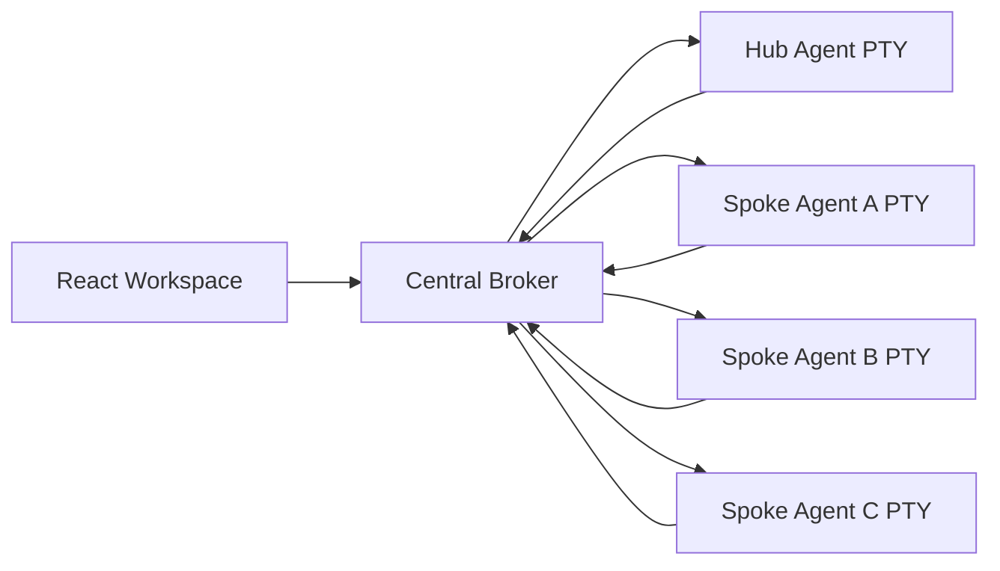

# Lightfold Grid

Lightfold Grid is a desktop multi-agent orchestrator for coordinating CLI-based AI agents.
It gives each agent an interactive pseudo-terminal, connects agents through a central
message broker, and displays their communication in a shared workspace.

Lightfold Grid is currently an early-stage prototype. Its message transport works, but the
project is actively being developed toward reliable orchestration of complex coding
workflows.

## Features

- Run multiple CLI agents in managed Electron PTYs.
- Configure each agent's CLI command, model, prompt, and workspace.
- Route agent messages through explicit connection graphs.
- Parse structured `[[STARLIGHT-MSG]]...[[END]]` envelopes from terminal output.
- Deliver messages to active interactive agent sessions.
- Track requests through delivery, acknowledgement, progress, and completion.
- Retry unacknowledged requests with bounded exponential backoff.
- Inspect and manually retry, cancel, or reassign failed requests.
- Automatically start configured agents and queue work until they report readiness.
- Track agent lifecycle, active tasks, heartbeats, crashes, and restarts.
- Persist broker messages, tasks, attempts, agents, settings, and audit events in SQLite.
- Recover interrupted requests after an application restart.
- Execute durable dependency-graph workflows with validated completion criteria.
- Gate destructive or release-related workflow tasks for human approval.
- Isolate coding tasks in per-task Git worktrees and branches.
- Gate coding-task merges on file ownership, tests, and explicit review.
- Generate versioned agent contracts with real identities, routes, capabilities, and tools.
- Emit valid protocol messages through the bundled `lightfold-message` helper.
- Exercise the complete broker-to-real-PTY-to-agent loop with deterministic fake agents.
- Monitor queues, latency, task duration, retries, failures, agent uptime, and workspace health.
- Inspect workflow dependency graphs, durable timelines, and correlated message chains.
- Export redacted diagnostic bundles for failed workflow investigation.
- Inspect message flow, status, and broker logs.
- Test wheel/spoke communication using deterministic agents or local Ollama models.

## Architecture



The Electron main process owns the durable broker database and append-only event log.
The renderer hydrates a subscribed projection of that state, listens to agent output
through the terminal registry, and executes live PTY delivery. Agent envelopes are
parsed, checked against the routing graph, persisted, and delivered to target PTYs in
per-target order.

The production PTY lifecycle is isolated in a reusable main-process service. The
integration harness composes that service with the durable store and orchestration
core to verify the same operating-system PTY boundary used by Electron.
See [plan.md](./plan.md) for the milestone roadmap.

## Requirements

- Node.js 22 or newer
- npm
- macOS or Linux for the current PTY process inspection behavior
- Optional: [Ollama](https://ollama.com/) and a local model for live integration tests
- Optional: Gemini CLI, GitHub Copilot CLI, or another interactive agent CLI

## Getting Started

```bash
npm install
npm run dev
```

Use the Lightfold Grid workspace to:

1. Select a project root.
2. Add or configure agent panes.
3. Configure allowed routing connections.
4. Boot the agents.
5. Send tasks through Lightfold Grid message envelopes.

## Message Envelopes

Lightfold Grid supports a versioned protocol:

```text
[[STARLIGHT-MSG]]{
  "protocolVersion": 1,
  "taskId": "existing-task-id-for-responses",
  "correlationId": "request-message-id",
  "to": "Pane-A",
  "kind": "result",
  "payload": {
    "summary": "Tests passed",
    "artifacts": ["test-results.log"]
  },
  "attempt": 1
}[[END]]
```

Supported message kinds are `request`, `ack`, `progress`, `result`, `error`, `cancel`,
`ready`, and `heartbeat`. The broker generates message IDs and task IDs for new
requests. Responses must include the request's task ID and may use `correlationId` to
reference a specific message.

The legacy envelope format remains supported:

```text
[[STARLIGHT-MSG]]{"from":"Pane-A","to":"Pane-B","command":"Inspect the failing tests","type":"task"}[[END]]
```

The `STARLIGHT` marker is retained as the stable version-1 wire protocol identifier.
Existing `starlight-message`, `starlight-workspace.json`, and `starlight-broker.sqlite`
installations continue to work; new installations use their `lightfold-*` equivalents.

The physical source pane is authoritative. Lightfold Grid does not trust an agent-generated
`from` value to impersonate another pane.

All accepted messages are normalized into the versioned protocol. Malformed and
unsupported messages are recorded as explicit broker errors. In-memory message history
is bounded while the full history and audit trail are retained in the durable broker
database according to the configured retention limit.

### Reliable Requests

Requests are delivered with broker-assigned task and message IDs. Receiving agents must
emit an `ack` containing the same `taskId` and the request's `messageId` as
`correlationId`. They should emit `progress`, `result`, or `error` messages using the
same identifiers.

Request states are:

```text
queued -> delivering -> delivered -> acknowledged -> completed
                                      \-> failed
```

A successful PTY write only means `delivered`. Missing acknowledgements trigger
exponential-backoff retries while preserving the request's IDs. Exhausted requests and
completion timeouts become inspectable dead letters. Expand a failed request in the
broker JSON log to retry or reassign it.

Acknowledgement timeout, completion timeout, maximum attempts, and retry base delay are
configurable under **Configure Grid -> General -> Reliable Delivery**.

### Agent Lifecycle

Every configured agent gets a PTY when its workspace loads, including agents whose
terminal tab is not visible. Lightfold Grid waits until the configured CLI is observable
before injecting a generated, versioned contract containing the agent's real pane ID,
role, allowed routes, capabilities, tools, and role instructions. The agent announces
readiness using the bundled helper:

```bash
lightfold-message ready --to broker --summary ready
```

Ready agents receive at most one active task. Additional requests remain queued until
the active task completes. Agents should emit a `heartbeat` message to `broker` at
least every 20 seconds; after 30 seconds without one, Lightfold Grid marks the agent
unresponsive. Failed or unresponsive agents can be restarted from their terminal tab,
and their failed active request can be retried or reassigned from the broker log.

Terminal tabs display lifecycle state and the current task. Hovering a tab shows its
last heartbeat and failure details.

Role prompt files contain role scope only. They intentionally contain no fixed pane
identities or hand-written protocol envelopes. The generated contract requires
acknowledgements, progress updates, and one structured terminal result. Use
`lightfold-message <kind>` with the arguments shown in the injected contract rather
than manually formatting JSON.

### Durable Broker State

The Electron main process stores normalized agents, messages, tasks, delivery attempts,
settings, and append-only audit events in `lightfold-grid-broker.sqlite` under Electron's
application data directory. Every message and lifecycle transition updates this
authoritative store.

When Lightfold Grid restarts, process-bound agent states reset to `stopped`. Requests that
were `delivering`, `delivered`, or `acknowledged` recover as `queued` with their stable
message and task IDs, then resume after the target agent reports readiness. Schema and
message protocol migrations run when the database opens.

Completed-message and audit-event retention is configurable under
**Configure Grid -> General -> Durable Broker Retention**.

### Workflows

Complex work is represented as a durable directed acyclic graph. Each task records its
owner, goal, dependencies, status, attempts, artifacts, completion criteria, failure
policy, and approval state. Tasks move through:

```text
planned -> blocked -> ready -> assigned -> running -> reviewing -> completed
                                                        \-> failed | cancelled
```

Lightfold Grid dispatches a task only after every prerequisite completed successfully.
Failed prerequisites keep dependents blocked. Result messages are validated against
required artifacts and summary text before the task can complete.

An orchestrator agent can submit a validated workflow definition to the broker:

```text
[[STARLIGHT-MSG]]{
  "protocolVersion": 1,
  "to": "broker",
  "kind": "request",
  "payload": {
    "instruction": "Create workflow",
    "data": {
      "workflowDefinition": {
        "id": "feature-1",
        "name": "Feature delivery",
        "goal": "Implement and verify the feature",
        "createdBy": "ignored-agent-value",
        "tasks": [
          {"id":"spec","owner":"Pane-A","goal":"Write the specification"},
          {"id":"build","owner":"Pane-B","goal":"Implement it","dependencies":["spec"],
           "requiredCapabilities":["coding"],"requiredTools":["git","npm"]},
          {"id":"test","owner":"Pane-C","goal":"Run tests","dependencies":["build"],
           "completionCriteria":{"requiredArtifacts":["test.log"]}}
        ]
      }
    }
  }
}[[END]]
```

The physical submitting pane becomes `createdBy`, task owners must be configured
agents, and cyclic or malformed decompositions are rejected. Tasks can use `block`,
`retry`, or `cancel-workflow` failure policies. Goals involving releases, publishing,
deployment, production, deletion, destruction, or migrations automatically require
human approval in the broker's **Workflows** tab. A task's `requiredCapabilities` and
`requiredTools` must be satisfied by its configured owner before the workflow is
accepted or the task is reassigned. Agent and task records retain the prompt contract
version used for execution.

### Safe Concurrent Coding

Add a `coding` configuration to a workflow task to run it in an isolated Git worktree:

```json
{
  "id": "build-api",
  "owner": "Pane-B",
  "goal": "Implement the API endpoint and commit the changes",
  "coding": {
    "files": ["src/api.ts", "tests/api.test.ts"],
    "testCommand": "npm test"
  }
}
```

Coding workflows require the selected workspace to be a Git repository, project-relative
declared files, and a test command. Every coding task requires human approval before
dispatch because its test command will execute locally. Lightfold Grid then creates a branch named
`lightfold-grid/<workflow>/<task>` and a worktree under the repository's Git directory. The
agent receives the exact worktree path and must work and commit there.

Declared files are reserved while a task is active. Lightfold Grid also inspects the actual
files changed from the task's base commit, blocks overlapping ownership unless a human
approves it, and surfaces merge conflicts in the workflow view. An agent result moves
the task to review; it does not complete the task. Lightfold Grid runs the configured tests,
then requires **Approve & Merge** before serially merging the branch into the clean
integration workspace. Failed and conflicted worktrees are preserved until explicit
forced cleanup.

### Operations And Diagnostics

The Central Broker **Ops** tab derives live operational metrics from the durable broker
snapshot. It shows queue depth, average delivery latency, task duration, retry and
failure counts, and the percentage of agents currently ready or busy.

Workspace health checks verify the selected Git repository, configured agent CLI
executables, prompt files, Ollama availability, and configured local models. Workflow
dependency graphs and durable event timelines make blocked or failed work visible
without reading raw terminal logs. Expanded JSON messages include the complete
correlated request, acknowledgement, progress, and terminal-result chain.

Use **Export** in the Ops tab to save a JSON diagnostic bundle containing the durable
snapshot, health results, and workspace configuration. Keys and values that look like
tokens, passwords, credentials, authorization headers, or API secrets are redacted.

## Testing

Run deterministic broker and wheel/spoke integration tests:

```bash
npm test
```

Run only the full broker-to-PTY integration harness:

```bash
npm run test:integration
```

The integration harness launches a hub and three spokes through real `node-pty`
sessions. It verifies delayed readiness, malformed output recovery, acknowledgement
retries, crash/restart recovery, durable broker updates, and a coding workflow that
edits an isolated worktree, runs tests, passes review, and merges.

Run the optional live Ollama wheel test:

```bash
npm run test:ollama
```

The live test defaults to `gemma4-32k:latest`. Override it with:

```bash
LIGHTFOLD_GRID_OLLAMA_MODEL=your-model npm run test:ollama
```

Build the production application:

```bash
npm run build
```

## Current Limitations

- Reliable acknowledgements require agents to follow the versioned protocol.
- Live delivery timers are reconstructed from persisted request state after restart.
- Live-model behavior remains dependent on the selected CLI and model; Ollama coverage
  is intentionally opt-in.

## Roadmap

Development is organized into milestone commits. The roadmap covers:

1. Reliable versioned message protocol
2. Acknowledgements, retries, and timeouts
3. Agent lifecycle and readiness
4. Durable broker state
5. Workflow dependency engine
6. Git worktree isolation
7. Prompt contract hardening
8. Full end-to-end integration testing
9. Observability and operational controls

See [plan.md](./plan.md) for detailed tasks and acceptance criteria.

### Milestone Status

- [x] Milestone 1: Reliable versioned message protocol
- [x] Milestone 2: Acknowledgements, retries, and timeouts
- [x] Milestone 3: Agent lifecycle and readiness
- [x] Milestone 4: Durable broker state
- [x] Milestone 5: Workflow dependency engine
- [x] Milestone 6: Git worktree isolation
- [x] Milestone 7: Prompt contract hardening
- [x] Milestone 8: Full end-to-end integration testing
- [x] Milestone 9: Observability and operational controls

## Open Source Status

Lightfold Grid is being prepared for open-source release. A public license, contribution
guide, security policy, and release packaging still need to be selected and added
before the first public release.

The project was renamed from Starlight to **Lightfold Grid**. Broader trademark and
brand clearance remains required before treating the name as protected. See
[OPEN_SOURCE_PLAN.md](./OPEN_SOURCE_PLAN.md) for the decision record, release
workstreams, and public-alpha criteria.
