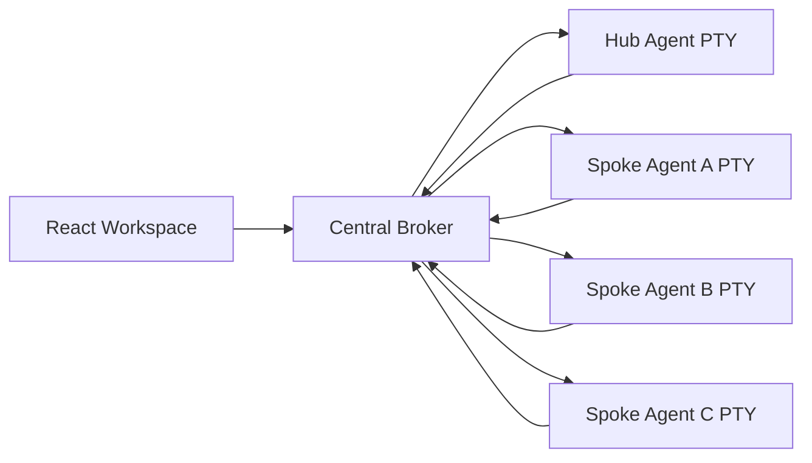

# Starlight

Starlight is a desktop multi-agent orchestrator for coordinating CLI-based AI agents.
It gives each agent an interactive pseudo-terminal, connects agents through a central
message broker, and displays their communication in a shared workspace.

Starlight is currently an early-stage prototype. Its message transport works, but the
project is actively being developed toward reliable orchestration of complex coding
workflows.

## Features

- Run multiple CLI agents in managed Electron PTYs.
- Configure each agent's CLI command, model, prompt, and workspace.
- Route agent messages through explicit connection graphs.
- Parse structured `[[STARLIGHT-MSG]]...[[END]]` envelopes from terminal output.
- Deliver messages to active interactive agent sessions.
- Track requests through delivery, acknowledgement, progress, and completion.
- Retry unacknowledged requests with bounded exponential backoff.
- Inspect and manually retry, cancel, or reassign failed requests.
- Automatically start configured agents and queue work until they report readiness.
- Track agent lifecycle, active tasks, heartbeats, crashes, and restarts.
- Persist broker messages, tasks, attempts, agents, settings, and audit events in SQLite.
- Recover interrupted requests after an application restart.
- Inspect message flow, status, and broker logs.
- Test wheel/spoke communication using deterministic agents or local Ollama models.

## Architecture



The Electron main process owns the durable broker database and append-only event log.
The renderer hydrates a subscribed projection of that state, listens to agent output
through the terminal registry, and executes live PTY delivery. Agent envelopes are
parsed, checked against the routing graph, persisted, and delivered to target PTYs in
per-target order.

Workflow scheduling will move into the Electron main process in later milestones.
See [plan.md](./plan.md) for the milestone roadmap.

## Requirements

- Node.js 22 or newer
- npm
- macOS or Linux for the current PTY process inspection behavior
- Optional: [Ollama](https://ollama.com/) and a local model for live integration tests
- Optional: Gemini CLI, GitHub Copilot CLI, or another interactive agent CLI

## Getting Started

```bash
npm install
npm run dev
```

Use the Starlight workspace to:

1. Select a project root.
2. Add or configure agent panes.
3. Configure allowed routing connections.
4. Boot the agents.
5. Send tasks through Starlight message envelopes.

## Message Envelopes

Starlight supports a versioned protocol:

```text
[[STARLIGHT-MSG]]{
  "protocolVersion": 1,
  "taskId": "existing-task-id-for-responses",
  "correlationId": "request-message-id",
  "to": "Pane-A",
  "kind": "result",
  "payload": {
    "summary": "Tests passed",
    "artifacts": ["test-results.log"]
  },
  "attempt": 1
}[[END]]
```

Supported message kinds are `request`, `ack`, `progress`, `result`, `error`, `cancel`,
`ready`, and `heartbeat`. The broker generates message IDs and task IDs for new
requests. Responses must include the request's task ID and may use `correlationId` to
reference a specific message.

The legacy envelope format remains supported:

```text
[[STARLIGHT-MSG]]{"from":"Pane-A","to":"Pane-B","command":"Inspect the failing tests","type":"task"}[[END]]
```

The physical source pane is authoritative. Starlight does not trust an agent-generated
`from` value to impersonate another pane.

All accepted messages are normalized into the versioned protocol. Malformed and
unsupported messages are recorded as explicit broker errors. In-memory message history
is bounded while the full history and audit trail are retained in the durable broker
database according to the configured retention limit.

### Reliable Requests

Requests are delivered with broker-assigned task and message IDs. Receiving agents must
emit an `ack` containing the same `taskId` and the request's `messageId` as
`correlationId`. They should emit `progress`, `result`, or `error` messages using the
same identifiers.

Request states are:

```text
queued -> delivering -> delivered -> acknowledged -> completed
                                      \-> failed
```

A successful PTY write only means `delivered`. Missing acknowledgements trigger
exponential-backoff retries while preserving the request's IDs. Exhausted requests and
completion timeouts become inspectable dead letters. Expand a failed request in the
broker JSON log to retry or reassign it.

Acknowledgement timeout, completion timeout, maximum attempts, and retry base delay are
configurable under **Configure Grid -> General -> Reliable Delivery**.

### Agent Lifecycle

Every configured agent gets a PTY when its workspace loads, including agents whose
terminal tab is not visible. Starlight waits until the configured CLI is observable
before injecting its startup instructions. The agent must then emit:

```text
[[STARLIGHT-MSG]]{"protocolVersion":1,"to":"broker","kind":"ready","payload":{"summary":"ready"},"attempt":1}[[END]]
```

Ready agents receive at most one active task. Additional requests remain queued until
the active task completes. Agents should emit a `heartbeat` message to `broker` at
least every 20 seconds; after 30 seconds without one, Starlight marks the agent
unresponsive. Failed or unresponsive agents can be restarted from their terminal tab,
and their failed active request can be retried or reassigned from the broker log.

Terminal tabs display lifecycle state and the current task. Hovering a tab shows its
last heartbeat and failure details.

### Durable Broker State

The Electron main process stores normalized agents, messages, tasks, delivery attempts,
settings, and append-only audit events in `starlight-broker.sqlite` under Electron's
application data directory. Every message and lifecycle transition updates this
authoritative store.

When Starlight restarts, process-bound agent states reset to `stopped`. Requests that
were `delivering`, `delivered`, or `acknowledged` recover as `queued` with their stable
message and task IDs, then resume after the target agent reports readiness. Schema and
message protocol migrations run when the database opens.

Completed-message and audit-event retention is configurable under
**Configure Grid -> General -> Durable Broker Retention**.

## Testing

Run deterministic broker and wheel/spoke integration tests:

```bash
npm test
```

Run the optional live Ollama wheel test:

```bash
npm run test:ollama
```

The live test defaults to `gemma4-32k:latest`. Override it with:

```bash
STARLIGHT_OLLAMA_MODEL=your-model npm run test:ollama
```

Build the production application:

```bash
npm run build
```

## Current Limitations

- Reliable acknowledgements require agents to follow the versioned protocol.
- Live delivery timers are reconstructed from persisted request state after restart.
- Complex tasks are not yet represented as durable dependency graphs.
- Concurrent coding agents do not yet use isolated Git worktrees.
- Full Electron-to-PTY-to-agent integration testing is still planned.

## Roadmap

Development is organized into milestone commits. The roadmap covers:

1. Reliable versioned message protocol
2. Acknowledgements, retries, and timeouts
3. Agent lifecycle and readiness
4. Durable broker state
5. Workflow dependency engine
6. Git worktree isolation
7. Prompt contract hardening
8. Full end-to-end integration testing
9. Observability and operational controls

See [plan.md](./plan.md) for detailed tasks and acceptance criteria.

### Milestone Status

- [x] Milestone 1: Reliable versioned message protocol
- [x] Milestone 2: Acknowledgements, retries, and timeouts
- [x] Milestone 3: Agent lifecycle and readiness
- [x] Milestone 4: Durable broker state
- [ ] Milestone 5: Workflow dependency engine
- [ ] Milestone 6: Git worktree isolation
- [ ] Milestone 7: Prompt contract hardening
- [ ] Milestone 8: Full end-to-end integration testing
- [ ] Milestone 9: Observability and operational controls

## Open Source Status

Starlight is being prepared for open-source release. A public license, contribution
guide, security policy, release packaging, and CI configuration still need to be
selected and added before the first public release.
